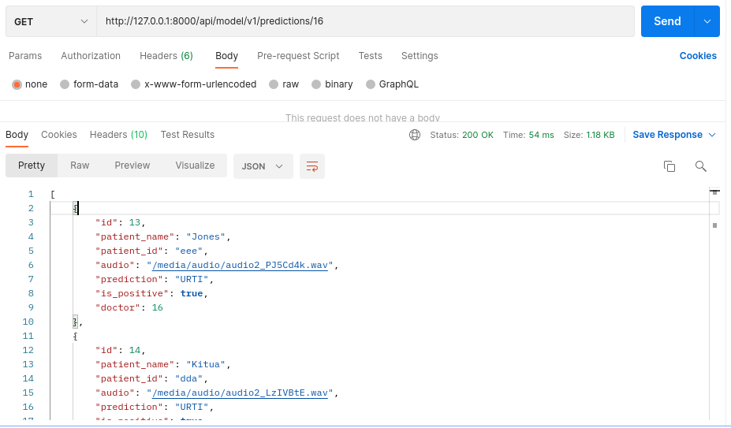

# :hospital: Daktariml
> :bulb: **Collaborative Project**
## 💬 Description
> This is a full stack project that is build with django and react. On the core of the project is a machine learning model that predicts illness from a respiratory sound recording. So users can visit the web app and view or add predictions made by the model.

## :performing_arts: Developers Team
1. Jones Nyamweya, ML Engineer
   > Worked on the machine learning model.
   * 

1. Athumani Bakari, Full Stack Engineer
   > Worked on the web app where the model is deployed.
   * 

## 📜 More
> ## UI/UX
* The responsive web application user interface is designed and tested on figma.
    >  A link to the figma file. 

> ## Database
* The web application uses sqlite database
    > The database is connected and used using django ORM.    
    <details>
      <summary>Database Architecture</summary>
      
      
    </details>

> ## Backend
  1. API endpoint to allow a user to create account
     > A blog API that gets user details and create a user account from the provided details
     <details>
      <summary>Postman screenshot</summary>
      
      
     </details>
  1. API endpoint to allow a user to login a user
     > A blog API that gets a user logged in to be able to use web services
     <details>
      <summary>Postman screenshot</summary>
      
      
     </details>
  1. API endpoint to get machine learning predictions from given respiratory sound
     > A blog API endpoint that gets prediction from the ml model
     <details>
      <summary>Postman screenshot</summary>
      
      
     </details>
  1. API endpoint to get all past prediction made by a logged in user.
     > A blog API endpoint that gets all predictions made by the ml model for viewing
     <details>
      <summary>Postman screenshot</summary>
      
      
     </details>

> ## Frontend
  1. Create and Login User
     > The frontend allows to create and login to use the web app services
     <details>
      <summary>Frontend Screenshots</summary>
      
      
      
     </details>
  1. Search, Filter and View predictons.
     > The frontend allows user to search for specific predictions with the the patient id, view past predictions (view and play respiratory sounds) and filter the predictions given with the results returned (negative or positive).
     <details>
      <summary>Frontend screenshot</summary>
      
      
     </details>
  1. Predict
     > The frontend allows user to add respiratory sounds and send them to the model for predictions. Also receive results from the request send instantly.
     <details>
      <summary>Frontend screenshot</summary>
      
      
      
     </details>

  1. Mobile Responsive
     > The frontend allows you to view the web app with your mobile phone, laptop and tablet with a responsive UI
     <details>
      <summary>Frontend screenshot</summary>
      
      
      

     </details>


> ## Machine Learning Model
  1. Audio Processing
     > Converts the audio files into suitable format (spectograms)
  1. Feature Extraction
     > Librosa library converts audio signals into spectograms or mfcc which represent frequency.
  1. Model Architecture
     > Model is build with CNN where the spectograms are treated as images and can be adapted for audio classification with layers such as Conv2D, Maxpool, dense and flatten.
  1. Model Compilations
     > 100 epochs used in training the model with accuracy of 77%
     <details>
      <summary>Models Overview</summary>
      
      
     </details>

## 🔧 Code Setup
   1. Clone the repo
        ```bash
            git clone https://github.com/devoure/respire

        ```
   1. Setup Frontend
        ```bash
            cd frontend/daktari-ml
            npm install

        ```
   1. Setup Backend
        ```bash
            cd backend/daktariml
            pip install -r requirements.txt
            python manage.py makemigrations
            python manage.py migrate
            python manage.py create superuser

        ```

## 💻🏃‍♂️ Running Code Snippet
   1. Run Backend code
        ```bash
            cd backend/daktariml
            python manage.py runserver

        ```
   1. Run Frontend Code
        ```bash
            cd frontend/daktari-ml
            npm run dev
        ```
